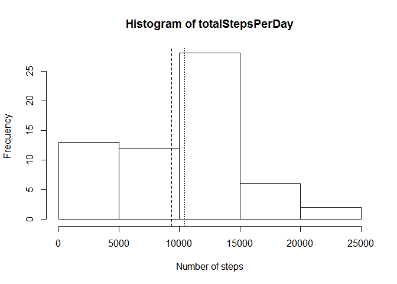
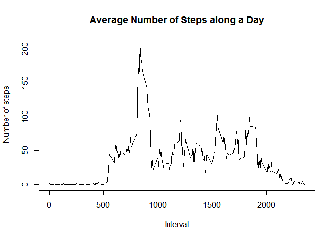
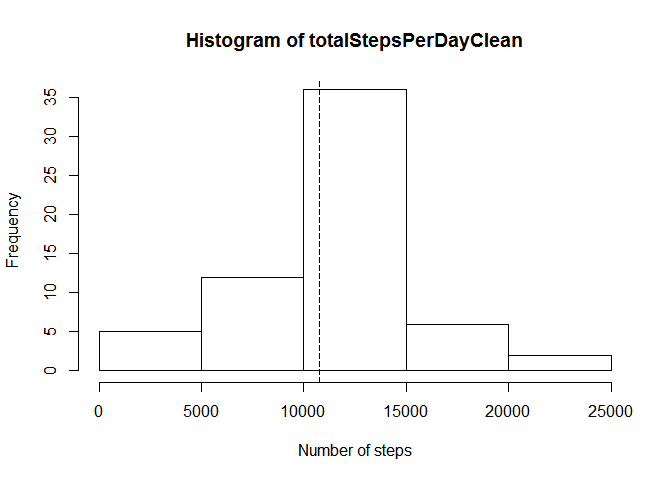
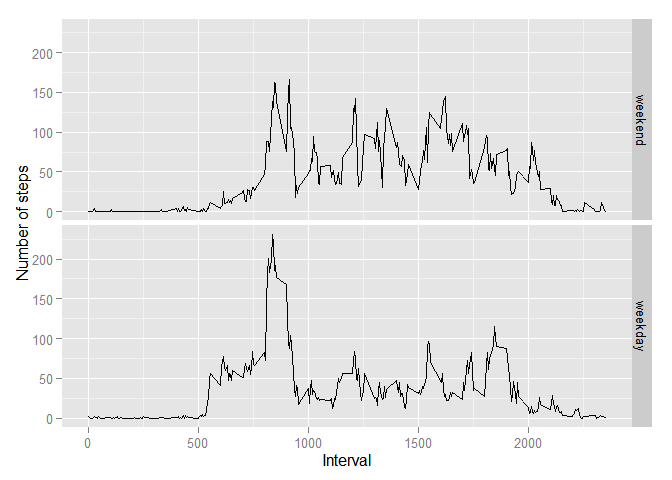

# Reproducible Research: Peer Assessment 1

# Introduction

This report documents the work done for the peer assesed project #1
in the couse "Reproducible Research"


At the very first, let's set up some infrastructure for the rest of this
report. The following lines are only technically motivated.


```r
library(ggplot2)
x <- Sys.setlocale("LC_ALL", "C")  # set locale to generic
sumNA.rm <- function(x) { sum(x, na.rm=TRUE) }
meanNA.rm <- function(x) { mean(x, na.rm=TRUE) }
```


## Loading and preprocessing the data

First, the data are to be loaded. The code assumes, that the data
are located in a comma-separated values file at "activity/activity.csv".


```r
# Loading the data
data <- read.csv('activity/activity.csv')

# set some aliases
dates <- as.factor(data$date)
intervals <- as.factor(data$interval)
```


## What is mean total number of steps taken per day?

In this section, we first sum up all the steps taken on each day of the given data.


```r
totalStepsPerDay <- tapply(data$steps, dates, FUN=sumNA.rm )

hist(totalStepsPerDay, #title="Total Steps per Day (raw data)",
     xlab="Number of steps")

meanSteps <- mean(totalStepsPerDay)
medianSteps <- median(totalStepsPerDay)

abline( v = meanSteps, lty=2 )
abline( v = medianSteps, lty=3 )
```

 

The mean number of steps per day is 9354.2
(marked as a dashed line in the above plot) while the median
numer of steps (the dotted line)
is 10395, respectively. 


## What is the average daily activity pattern?

Next, the question to be answered is, on how many steps in average
are taken along per day?


```r
meanStepsAlongDay <- tapply(data$steps, intervals, FUN=meanNA.rm)

plot(levels(intervals), meanStepsAlongDay, type='l', xlab="Interval", ylab="Number of steps")
title("Average Number of Steps along a Day")
```

 

```r
maxInterval <- which.max(meanStepsAlongDay)
```

On average per all days, the 5-minute interval with the most steps taken is in the morning at 835.


## Imputing missing values

Unfortunately, the supplied data are not complete in the sense, that
some missing step counts are in the file. Since missing values
might imply a bias, we try a strategy for replacing the missing
values.


```r
numNa <- sum(is.na(data$steps))
numNaR <- numNa / nrow(data)
```

The number of missing data values in the file are 2304 which
is roughly 13 % of all data rows, respecitvely.


Next, the missing values are to be replaced by the average steps number of the interval the value is missing for.


```r
# generate a new data frame with NAs replace
data2 <- data
data2$steps = ifelse( is.na(data2$steps),
                      meanStepsAlongDay[match(data2$interval,
                                              intervals)],
                      data2$steps )

# count steps per day
totalStepsPerDayClean <- tapply(data2$steps, dates, FUN=sum )

# plot the histogram
hist(totalStepsPerDayClean, #title="Total Steps per Day (cleaned data)",
      xlab="Number of steps")

meanStepsClean <- mean(totalStepsPerDayClean)
medianStepsClean <- median(totalStepsPerDayClean)

abline( v = meanStepsClean, lty=2 )
abline( v = medianStepsClean, lty=3 )
```

 

Obviously, this histogram looks different from the histogram using the raw data.
Here, the mean number of steps per day is 10766.2
(dashed line) while the median numer of steps (the dotted line)
is 10766.2, respectively.
Interestingly, here the mean and median values fell together. However, this is not unexpected, since the clean data somewhat appear to be normally distributed. This was not true for the raw data.

Both, mean and median value of the data with replaced missing values are significantly increased with respect to the counterparts of the raw data.

Thus, taking the interval mean value as a replacement for missing values, shifts the distribution of steps upwards.


## Are there differences in activity patterns between weekdays and weekends?

Now, we'll have a look whether the number of steps differs between typical week days (i.e. working days) and week end days (i.e. non-working).


```r
# - get day categories for every date
dc <- weekdays(as.Date(dates), abbreviate=T) %in% 
    c("Mon", "Tue", "Wed", "Thu", "Fri")
dc <- factor( dc, levels=c(F, T), labels=c("weekend", "weekday"))

ys <- aggregate(list(steps=data2$steps), 
                by=list(Interval=data2$interval, day.cat=dc), FUN=mean)

qp <- qplot(Interval, steps, data=ys, facets=day.cat~., geom="line") +
    labs( y = "Number of steps")
print(qp)
```

 

It appears, that the pattern of activity in fact does look a little different between week days and week ends.
